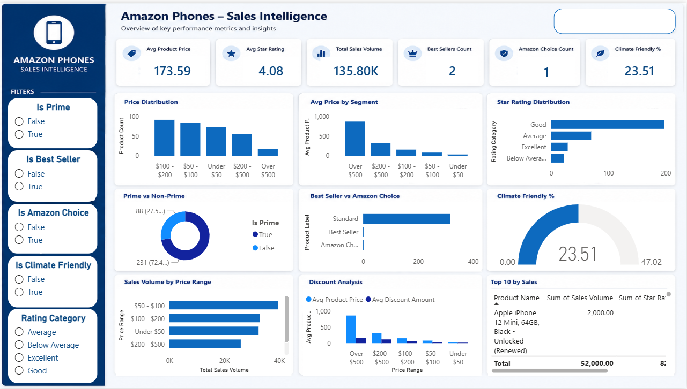

# Amazon Phones Sales Intelligence Dashboard

## Overview

The Amazon Phones Sales Intelligence Dashboard is a Power BI analytics project designed to transform raw Amazon smartphone marketplace data into actionable business insights.

This dashboard provides a comprehensive view of product performance, pricing strategies, customer ratings, sales volume, Prime eligibility, Amazon Choice products, Best Sellers, and Climate Friendly products. It was developed using Power BI with a focus on executive reporting, interactive exploration, and data-driven decision-making.

---

## Project Objectives

* Analyze smartphone product performance on Amazon.
* Identify pricing trends across different product segments.
* Evaluate sales volume distribution by price range.
* Measure the impact of discounts on product positioning.
* Compare Prime and Non-Prime product availability.
* Analyze Best Seller and Amazon Choice products.
* Monitor sustainability indicators through Climate Friendly products.
* Provide an executive-level dashboard for business stakeholders.

---

## Dataset

The dataset contains Amazon smartphone product information, including:

* Product Name
* Current Price
* Original Price
* Discount Amount
* Discount Percentage
* Sales Volume
* Star Rating
* Number of Ratings
* Prime Eligibility
* Amazon Choice Status
* Best Seller Status
* Climate Friendly Status
* Product Availability

---

## Data Preparation

Data preparation included:

* Data cleaning and validation
* Handling missing values
* Data type conversion
* Creation of calculated columns
* Feature engineering for business analysis

### Calculated Columns

* Price Range
* Rating Category
* Product Label
* Discount Amount
* Discount Percentage

---

## DAX Measures

Key measures created in Power BI include:

* Average Product Price
* Average Star Rating
* Total Sales Volume
* Best Sellers Count
* Amazon Choice Count
* Climate Friendly Percentage
* Prime Percentage
* Average Discount Amount
* Product Count

---

## Dashboard Features

### KPI Cards

* Average Product Price
* Average Star Rating
* Total Sales Volume
* Best Sellers Count
* Amazon Choice Count
* Climate Friendly Percentage

### Visualizations

* Price Distribution Analysis
* Average Price by Segment
* Star Rating Distribution
* Prime vs Non-Prime Analysis
* Best Seller vs Amazon Choice Comparison
* Climate Friendly Gauge
* Sales Volume by Price Range
* Discount Analysis
* Top 10 Products by Sales

### Interactive Filters

* Prime Products
* Best Sellers
* Amazon Choice
* Climate Friendly Products
* Price Range
* Rating Category

---

## Tools & Technologies

* Power BI Desktop
* DAX (Data Analysis Expressions)
* Power Query
* Data Modeling
* Interactive Dashboard Design

---

## Business Insights Generated

The dashboard helps answer questions such as:

* Which price segment generates the highest sales volume?
* How do discounts influence product positioning?
* What proportion of products are Prime eligible?
* Which products achieve Best Seller or Amazon Choice status?
* How are customer ratings distributed across products?
* What percentage of products meet Climate Friendly standards?

---

## Dashboard Preview

---

